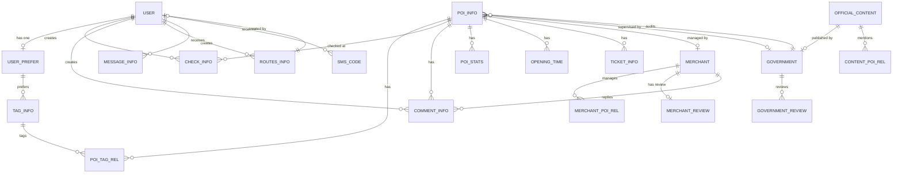

# 智慧旅游平台数据库设计文档

## 数据库类型

MySQL 8.0.30

---

## 一、系统架构概述

本系统分为三个端口：
- **用户端**：面向游客的微信小程序
- **商户端**：面向景区、商户的管理后台
- **政府端**：面向文旅局/景区管理方的管理后台

### 用户认证体系说明

本系统支持**三级用户认证体系**，兼顾用户体验与账户安全：

| 层级 | 认证方式 | 可用功能 | Token有效期 | 说明 |
|------|---------|---------|------------|------|
| 公共接口 | 无需认证 | POI搜索、POI详情、官方内容浏览、附近POI | - | 完全开放，所有用户可用 |
| 匿名用户 | 自动匿名Token | 个性化推荐、AI规划(限次)、设置偏好 | 30天 | 自动创建，无需任何信息 |
| 正式用户 | 微信登录/手机号+密码 | 所有功能：打卡、评论、创建路线、消息等 | 7天 | 微信授权或手机号注册登录 |

**账号升级流程**：匿名用户可通过绑定手机号（+短信验证码）升级为正式用户，无需重复注册。

---

## 二、用户认证体系设计

### 2.1 认证层级详解

```
┌─────────────────────────────────────────────────────────────┐
│                      用户认证体系                             │
├─────────────────────────────────────────────────────────────┤
│                                                             │
│  ┌─────────────────┐      ┌─────────────────┐              │
│  │    匿名用户      │─────▶│    正式用户      │              │
│  │  (自动创建)      │ 绑定  │  (微信/手机)    │              │
│  │                 │ 手机号│                 │              │
│  └────────┬────────┘      └────────┬────────┘              │
│           │                        │                        │
│           │ Token: 30天            │ Token: 7天            │
│           ▼                        ▼                        │
│  ┌─────────────────┐      ┌─────────────────┐              │
│  │ 可用功能:        │      │ 可用功能:        │              │
│  │ - 搜索/浏览POI   │      │ - 所有功能       │              │
│  │ - AI推荐(限次)   │      │ - 打卡/评论     │              │
│  │ - 设置偏好       │      │ - 创建路线      │              │
│  │ - 个性化推荐     │      │ - 消息通知      │              │
│  └─────────────────┘      └─────────────────┘              │
│                                                             │
└─────────────────────────────────────────────────────────────┘
```

### 2.2 注册类型枚举

| register_type | 说明 | 登录方式 | 特点 |
|---------------|------|---------|------|
| 0 | 匿名注册 | 自动生成Token | 无需任何信息，可快速体验 |
| 1 | 微信注册 | 微信授权code | 获取昵称、头像、地区信息 |
| 2 | 手机号注册 | 手机号+密码 | 支持账号密码登录 |
| 3 | 微信+手机绑定 | 微信授权+手机号 | 合并账号，数据完整 |

### 2.3 公共接口列表（无需认证）

| 接口 | 方法 | 说明 |
|------|------|------|
| `/api/poi/search` | GET | POI搜索 |
| `/api/poi/nearby` | GET | 附近POI查询 |
| `/api/poi/:id` | GET | POI详情浏览 |
| `/api/poi/heatmap` | GET | 热力图数据 |
| `/api/content` | GET | 官方内容浏览 |
| `/api/content/:id` | GET | 内容详情 |
| `/api/announcement` | GET | 系统公告 |

### 2.4 匿名可用接口列表（optionalAuth中间件）

| 接口 | 方法 | 说明 |
|------|------|------|
| `/api/user/anonymous` | POST | 获取/刷新匿名Token |
| `/api/poi/recommend` | GET | 个性化推荐（基于匿名偏好） |
| `/api/poi/ai-plan` | POST | AI路线规划（限制次数） |
| `/api/user/preference` | POST | 设置偏好（匿名用户） |

### 2.5 需完整登录接口列表（requiredAuth中间件）

| 接口 | 方法 | 说明 |
|------|------|------|
| `/api/user/wechat-login` | POST | 微信授权登录 |
| `/api/user/phone-login` | POST | 手机号登录 |
| `/api/user/bind-phone` | POST | 绑定手机号（匿名用户升级） |
| `/api/user/bind-wechat` | POST | 关联微信（手机用户绑定微信） |
| `/api/user/profile` | GET | 个人中心 |
| `/api/user/profile` | PUT | 更新个人资料 |
| `/api/user/routes` | GET | 我的路线 |
| `/api/route` | POST | 创建路线 |
| `/api/check` | POST | 打卡 |
| `/api/comment` | POST | 发表评价 |
| `/api/message` | GET | 消息列表 |

---

## 二、ER图设计



---

## 三、完整数据表设计

### 3.1 用户端相关表

#### 3.1.1 user（用户表）

**表说明**：存储用户基础信息，支持微信登录、手机号登录、匿名访问三种模式。

| 字段名 | 类型 | 约束 | 说明 |
|--------|------|------|------|
| id | INT | PRIMARY KEY, AUTO_INCREMENT | 主键 |
| tel | VARCHAR(20) | UNIQUE, NULL, INDEX | 手机号（可选，绑定后填写） |
| openid | VARCHAR(100) | UNIQUE, NOT NULL, INDEX | 微信唯一标识 |
| password | VARCHAR(255) | NULL | 密码（手机号登录时使用） |
| nickname | VARCHAR(50) | NULL | 昵称 |
| avatar | VARCHAR(255) | NULL | 头像地址 |
| gender | TINYINT(1) | NULL | 性别（0未知1男2女） |
| locale | VARCHAR(10) | DEFAULT 'zh-CN' | 语言设置 |
| register_type | TINYINT(1) | DEFAULT 0, INDEX | 注册类型（0匿名1微信2手机3微信+手机） |
| status | TINYINT(1) | DEFAULT 0, INDEX | 状态（0正常1注销） |
| ai_plan_count | INT | DEFAULT 0 | AI规划剩余次数（匿名3次/正式用户5次） |
| last_login_at | DATETIME | NULL | 最后登录时间 |
| created_at | DATETIME | DEFAULT CURRENT_TIMESTAMP | 创建时间 |
| updated_at | DATETIME | DEFAULT CURRENT_TIMESTAMP ON UPDATE CURRENT_TIMESTAMP | 更新时间 |

**索引设计**：
- PRIMARY KEY: `id`
- UNIQUE INDEX: `idx_openid` ON `openid`
- UNIQUE INDEX: `idx_tel` ON `tel`
- INDEX: `idx_register_type` ON `register_type`

**业务规则**：
- `openid` 必填，微信登录或匿名时自动生成
- `tel` 可选，绑定手机号后填写
- `password` 可选，仅手机号登录用户需要
- `register_type` 决定用户来源和可用功能
- `ai_plan_count` 限制AI路线规划使用次数，防止滥用

---

#### 3.1.2 sms_code（短信验证码表）

**表说明**：存储短信验证码记录，用于手机号绑定和登录验证。

| 字段名 | 类型 | 约束 | 说明 |
|--------|------|------|------|
| id | BIGINT | PRIMARY KEY, AUTO_INCREMENT | 主键 |
| phone | VARCHAR(20) | NOT NULL, INDEX | 手机号 |
| code | VARCHAR(10) | NOT NULL | 验证码（6位数字） |
| type | VARCHAR(20) | NOT NULL | 验证码类型（bind/ login/ reset） |
| used | TINYINT(1) | DEFAULT 0 | 是否已使用 |
| expired_at | DATETIME | NOT NULL | 过期时间 |
| created_at | DATETIME | DEFAULT CURRENT_TIMESTAMP | 创建时间 |

**业务规则**：
- 验证码有效期5分钟
- 每个手机号每分钟最多发送1次
- 每个手机号每天最多发送10次
- 验证成功后标记为已使用

---

#### 3.1.2 user_prefer（用户偏好表）

**表说明**：存储用户的国籍和偏好标签。偏好标签包含活动强度和其他兴趣标签。

| 字段名 | 类型 | 约束 | 说明 |
|--------|------|------|------|
| id | INT | PRIMARY KEY, AUTO_INCREMENT | 主键 |
| user_id | INT | UNIQUE, NOT NULL, INDEX, FOREIGN KEY | 关联user.id |
| from_region | TINYINT(1) | NOT NULL | 国籍（0日韩1国内2欧美3本地） |
| preference_tags | JSON | NULL | 偏好标签列表 |
| has_completed_onboarding | TINYINT(1) | DEFAULT 0 | 是否完成引导 |
| created_at | DATETIME | DEFAULT CURRENT_TIMESTAMP | 创建时间 |
| updated_at | DATETIME | DEFAULT CURRENT_TIMESTAMP ON UPDATE CURRENT_TIMESTAMP | 更新时间 |

**字段说明**：
- `from_region`：0=日韩，1=国内，2=欧美，3=本地
- `preference_tags`：JSON数组，包含活动强度标签和其他兴趣标签

**偏好标签说明**：
```json
{
  "intensity": ["leisure", "explorer"],  // 活动强度：休闲漫步、暴走特种兵
  "interests": ["historical", "food", "coffee"]  // 兴趣标签：历史建筑、美食、咖啡
}
```

**标签分类枚举**：
| 分类 | 说明 | 示例标签 |
|------|------|----------|
| intensity | 活动强度 | leisure(休闲漫步)、explorer(暴走特种兵)、intimate(深度体验) |
| theme | 主题标签 | historical(历史建筑)、nature(自然风光)、art(艺术展览) |
| cuisine | 菜系标签 | food(美食探店)、coffee(咖啡文化) |
| mood | 情绪标签 | nightlife(夜生活) |

---

#### 3.1.3 poi_info（POI 地点信息表）

**表说明**：存储景点、商户等兴趣点的基础信息，支持多语言。

| 字段名 | 类型 | 约束 | 说明 |
|--------|------|------|------|
| id | INT | PRIMARY KEY, AUTO_INCREMENT | 主键 |
| poi_uuid | VARCHAR(50) | UNIQUE, NOT NULL, INDEX | 高德地图POI唯一标识 |
| poi_type | VARCHAR(100) | INDEX | 地图原始分类 |
| type_code | VARCHAR(20) | INDEX | 地图原始分类编码 |
| poi_name | JSON | NOT NULL | 名称（多语言） |
| description | JSON | NULL | 描述（多语言） |
| longitude | DECIMAL(10,7) | NOT NULL | 经度 |
| latitude | DECIMAL(10,7) | NOT NULL | 纬度 |
| address | JSON | NULL | 地址（多语言） |
| tel | VARCHAR(20) | NULL | 联系电话 |
| email | VARCHAR(100) | NULL | 邮箱 |
| photos | JSON | NULL | 照片列表 |
| street_view | VARCHAR(512) | NULL | 街景图URL |
| district | VARCHAR(50) | INDEX | 行政区 |
| is_free | TINYINT(1) | DEFAULT 0 | 是否免费（0否1是） |
| need_tickets | TINYINT(1) | DEFAULT 0 | 是否需要门票 |
| official_url | VARCHAR(255) | NULL | 官方预约/购票链接 |
| need_book | TINYINT(1) | DEFAULT 0 | 是否需要预约 |
| status | TINYINT(1) | DEFAULT 1, INDEX | 状态（0待审核1正常2下架） |
| audit_status | TINYINT(1) | DEFAULT 0, INDEX | 审核状态（0待审核1通过2拒绝） |
| audit_remark | VARCHAR(255) | NULL | 审核备注 |
| audited_by | INT | NULL, FOREIGN KEY | 审核人（government.id） |
| audited_at | DATETIME | NULL | 审核时间 |
| created_by | INT | NULL | 创建人（merchant.id或government.id） |
| created_at | DATETIME | DEFAULT CURRENT_TIMESTAMP | 创建时间 |
| updated_at | DATETIME | DEFAULT CURRENT_TIMESTAMP ON UPDATE CURRENT_TIMESTAMP | 更新时间 |

**索引设计**：
- PRIMARY KEY: `id`
- UNIQUE INDEX: `idx_poi_uuid` ON `poi_uuid`
- INDEX: `idx_status` ON `status`
- INDEX: `idx_audit_status` ON `audit_status`
- INDEX: `idx_district` ON `district`
- INDEX: `idx_lat_lng` ON `(latitude, longitude)`

**业务规则**：
- 系统内置POI初始status为1
- 商户新增POI初始status为0，需政府审核
- 政府管理员可直接创建/审核POI

---

#### 3.1.4 poi_stats（POI 统计表）

**表说明**：存储 POI 的按日聚合统计数据，用于热力图展示。

| 字段名 | 类型 | 约束 | 说明 |
|--------|------|------|------|
| id | INT | PRIMARY KEY, AUTO_INCREMENT | 主键 |
| poi_id | INT | NOT NULL, INDEX, FOREIGN KEY | 关联poi_info.id |
| date | DATE | NOT NULL, INDEX | 统计日期 |
| check_count | INT | DEFAULT 0 | 当日有效打卡次数 |
| heat_score | DECIMAL(5,2) | DEFAULT 0.00 | 热力指数（0–100） |
| avg_stay_time | DECIMAL(5,2) | DEFAULT 0.00 | 当日平均停留时长（小时） |
| created_at | DATETIME | DEFAULT CURRENT_TIMESTAMP | 创建时间 |
| updated_at | DATETIME | DEFAULT CURRENT_TIMESTAMP ON UPDATE CURRENT_TIMESTAMP | 更新时间 |

**索引设计**：
- PRIMARY KEY: `id`
- UNIQUE INDEX: `idx_poi_date` ON `(poi_id, date)`
- INDEX: `idx_heat_score` ON `heat_score`

**热力指数计算公式**：
```
打卡分 S_c = 70 * min(1, ln(1 + check_count) / ln(1 + C_max))
停留分 S_s = 30 * min(1, avg_stay_time / 2)
heat_score = LEAST(100, S_c + S_s)
```

---

#### 3.1.5 tag_info（标签表）

**表说明**：存储标签信息，支持层级结构和多语言。

| 字段名 | 类型 | 约束 | 说明 |
|--------|------|------|------|
| id | INT | PRIMARY KEY, AUTO_INCREMENT | 主键 |
| level | INT | NOT NULL, INDEX | 层级深度（1为顶级） |
| parent_id | INT | NULL, INDEX, FOREIGN KEY | 父级标签ID |
| tag_code | VARCHAR(50) | UNIQUE, NOT NULL, INDEX | 标签编码 |
| tag_name | JSON | NOT NULL | 标签名称（多语言） |
| category | VARCHAR(20) | INDEX | 标签分类 |
| status | TINYINT(1) | DEFAULT 1, INDEX | 状态（0禁用1启用） |
| created_at | DATETIME | DEFAULT CURRENT_TIMESTAMP | 创建时间 |
| updated_at | DATETIME | DEFAULT CURRENT_TIMESTAMP ON UPDATE CURRENT_TIMESTAMP | 更新时间 |

**标签分类**：
- `intensity`（活动强度）：leisure、explorer、intimate、family
- `theme`（主题）：historical、night_view、architecture、landmark、tower、view、garden、culture、museum、art、shopping、theme_park、park、nature、science、education、entertainment、history、free、tickets_required
- `cuisine`（菜系）：food、cafe
- `mood`（情绪）：nightlife

**初始化方式**：标签数据通过 `scripts/init-poi-data.ts` 脚本自动创建。运行脚本时，会先将 `TAG_MAP` 中定义的所有标签 upsert 到数据库，无需手动插入。再次运行脚本会更新已存在标签的名称/分类。

**预设标签列表（由 init-poi-data.ts 初始化）**：

| tag_code | 中文名称 | 分类 |
|----------|----------|------|
| historical | 历史建筑 | theme |
| night_view | 夜景 | theme |
| architecture | 建筑艺术 | theme |
| free | 免费景点 | theme |
| landmark | 地标建筑 | theme |
| tower | 观光塔 | theme |
| view | 观景胜地 | theme |
| tickets_required | 需购票 | theme |
| garden | 园林 | theme |
| culture | 文化体验 | theme |
| museum | 博物馆 | theme |
| art | 艺术展览 | theme |
| shopping | 购物娱乐 | theme |
| food | 美食探店 | cuisine |
| cafe | 咖啡文化 | cuisine |
| nightlife | 夜生活 | mood |
| theme_park | 主题乐园 | theme |
| family | 亲子游 | intensity |
| park | 公园绿地 | theme |
| nature | 自然风光 | theme |
| science | 科技体验 | theme |
| education | 科普教育 | theme |
| entertainment | 娱乐休闲 | theme |
| history | 历史人文 | theme |
| leisure | 休闲漫步 | intensity |
| explorer | 暴走特种兵 | intensity |
| intimate | 深度体验 | intensity |

---

#### 3.1.6 poi_tag_rel（POI与标签关联表）

**表说明**：POI与标签的多对多关系表。

| 字段名 | 类型 | 约束 | 说明 |
|--------|------|------|------|
| id | INT | PRIMARY KEY, AUTO_INCREMENT | 主键 |
| poi_id | INT | NOT NULL, INDEX, FOREIGN KEY | 关联poi_info.id |
| tag_id | INT | NOT NULL, INDEX, FOREIGN KEY | 关联tag_info.id |
| weight | DECIMAL(3,2) | DEFAULT 0.50 | 权重（0-1） |
| created_at | DATETIME | DEFAULT CURRENT_TIMESTAMP | 创建时间 |
| updated_at | DATETIME | DEFAULT CURRENT_TIMESTAMP ON UPDATE CURRENT_TIMESTAMP | 更新时间 |

**索引设计**：
- PRIMARY KEY: `id`
- UNIQUE INDEX: `idx_poi_tag` ON `(poi_id, tag_id)`
- INDEX: `idx_tag_weight` ON `(tag_id, weight)`

---

#### 3.1.7 routes_info（AI 路线表）

**表说明**：存储LLM规划的旅游路线，用户可分享。

| 字段名 | 类型 | 约束 | 说明 |
|--------|------|------|------|
| id | INT | PRIMARY KEY, AUTO_INCREMENT | 主键 |
| user_id | INT | NOT NULL, INDEX, FOREIGN KEY | 关联user.id |
| route_name | JSON | NOT NULL | 路线名称（多语言） |
| total_days | INT | NOT NULL | 游玩天数 |
| description | JSON | NULL | 路线描述（多语言） |
| poi_list | JSON | NOT NULL | POI ID列表 |
| route_detail | JSON | NULL | 路线详情 |
| cover_image | VARCHAR(255) | NULL | 封面图 |
| tags | JSON | NULL | 标签列表 |
| is_ai_generated | TINYINT(1) | DEFAULT 0 | 是否AI生成 |
| source_prompt | TEXT | NULL | AI生成时的用户输入 |
| use_count | INT | DEFAULT 0 | 使用次数 |
| status | TINYINT(1) | DEFAULT 0, INDEX | 状态（0已生成1已完成） |
| created_at | DATETIME | DEFAULT CURRENT_TIMESTAMP | 创建时间 |
| updated_at | DATETIME | DEFAULT CURRENT_TIMESTAMP ON UPDATE CURRENT_TIMESTAMP | 更新时间 |

**索引设计**：
- PRIMARY KEY: `id`
- INDEX: `idx_user_id` ON `user_id`
- INDEX: `idx_use_count` ON `use_count`
- INDEX: `idx_created_at` ON `created_at`

---

#### 3.1.8 check_info（打卡表）

**表说明**：存储用户打卡记录，支撑自由打卡与路线打卡双模式。

| 字段名 | 类型 | 约束 | 说明 |
|--------|------|------|------|
| id | INT | PRIMARY KEY, AUTO_INCREMENT | 主键 |
| user_id | INT | NOT NULL, INDEX, FOREIGN KEY | 关联user.id |
| poi_id | INT | NOT NULL, INDEX, FOREIGN KEY | 关联poi_info.id |
| route_id | INT | NULL, INDEX, FOREIGN KEY | 关联routes_info.id（NULL=自由打卡） |
| check_time | DATETIME | NOT NULL, INDEX | 打卡时刻 |
| longitude | DECIMAL(10,7) | NOT NULL | 打卡经度（GCJ-02） |
| latitude | DECIMAL(10,7) | NOT NULL | 打卡纬度（GCJ-02） |
| distance | DECIMAL(10,2) | NULL | 与景点中心的距离（米） |
| stay_mins | INT | NULL | 停留时长（分钟） |
| hour_tag | TINYINT | NOT NULL, INDEX | 小时段 0–23 |
| week_tag | TINYINT | NOT NULL, INDEX | 周几（1=周一…7=周日） |
| month_tag | TINYINT | NOT NULL, INDEX | 月份 1–12 |
| year_tag | INT | NOT NULL, INDEX | 年份 YYYY |
| day_tag | DATE | NOT NULL, INDEX | 打卡日期 |
| note | VARCHAR(255) | NULL | 打卡备注 |
| created_at | DATETIME | DEFAULT CURRENT_TIMESTAMP | 记录创建时间 |

**索引设计**：
- PRIMARY KEY: `id`
- INDEX: `idx_poi_time` ON `(poi_id, check_time)`
- INDEX: `idx_user_poi_day` ON `(user_id, poi_id, day_tag)`
- INDEX: `idx_route_id` ON `route_id`

**业务规则**：
- `route_id` 非空为路线打卡，为空为自由打卡
- GPS校验：到达POI附近（如≤200m）才允许写入

---

#### 3.1.9 comment_info（评论表）

**表说明**：存储用户对景点的评论，支持商户追评。

| 字段名 | 类型 | 约束 | 说明 |
|--------|------|------|------|
| id | INT | PRIMARY KEY, AUTO_INCREMENT | 主键 |
| user_id | INT | NOT NULL, INDEX, FOREIGN KEY | 关联user.id |
| poi_id | INT | NOT NULL, INDEX, FOREIGN KEY | 关联poi_info.id |
| route_id | INT | NULL, INDEX, FOREIGN KEY | 关联routes_info.id |
| rating | DECIMAL(2,1) | NOT NULL | 评分（1.0-5.0） |
| content | TEXT | NOT NULL | 评论内容 |
| images | JSON | NULL | 图片列表 |
| helpful_count | INT | DEFAULT 0 | 有用次数 |
| merchant_reply | TEXT | NULL | 商户追评 |
| reply_time | DATETIME | NULL | 回复时间 |
| status | TINYINT(1) | DEFAULT 1, INDEX | 状态（0删除1正常） |
| audit_status | TINYINT(1) | DEFAULT 0, INDEX | 审核状态（0正常1待审2违规3放行） |
| is_reported | TINYINT(1) | DEFAULT 0, INDEX | 是否被举报 |
| created_at | DATETIME | DEFAULT CURRENT_TIMESTAMP | 创建时间 |
| updated_at | DATETIME | DEFAULT CURRENT_TIMESTAMP ON UPDATE CURRENT_TIMESTAMP | 更新时间 |

**索引设计**：
- PRIMARY KEY: `id`
- INDEX: `idx_poi_rating` ON `(poi_id, rating)`
- INDEX: `idx_user_id` ON `user_id`
- INDEX: `idx_created_at` ON `created_at`

**业务规则**：
- 用户必须先在对应路线下打卡该POI才能评论
- C端默认展示audit_status=0且status=1的评论

---

#### 3.1.10 official_content（官方内容表）

**表说明**：存储政府端发布的官方图文/视频内容。

| 字段名 | 类型 | 约束 | 说明 |
|--------|------|------|------|
| id | INT | PRIMARY KEY, AUTO_INCREMENT | 主键 |
| gov_id | INT | NOT NULL, INDEX, FOREIGN KEY | 关联government.id |
| title | JSON | NOT NULL | 标题（多语言） |
| summary | JSON | NULL | 摘要（多语言） |
| content | JSON | NOT NULL | 内容（多语言） |
| content_type | VARCHAR(20) | NOT NULL, INDEX | 内容类型（article/video） |
| cover_image | VARCHAR(255) | NULL | 封面图 |
| video_url | VARCHAR(255) | NULL | 视频URL |
| category | VARCHAR(50) | NULL | 分类 |
| tags | JSON | NULL | 标签 |
| related_poi_ids | JSON | NULL | 关联POI ID列表 |
| view_count | INT | DEFAULT 0 | 浏览次数 |
| like_count | INT | DEFAULT 0 | 点赞次数 |
| status | TINYINT(1) | DEFAULT 1, INDEX | 状态（0下线1发布） |
| published_at | DATETIME | NULL | 发布时间 |
| created_at | DATETIME | DEFAULT CURRENT_TIMESTAMP | 创建时间 |
| updated_at | DATETIME | DEFAULT CURRENT_TIMESTAMP ON UPDATE CURRENT_TIMESTAMP | 更新时间 |

**索引设计**：
- PRIMARY KEY: `id`
- INDEX: `idx_gov_id` ON `gov_id`
- INDEX: `idx_status_published` ON `(status, published_at)`
- INDEX: `idx_content_type` ON `content_type`

---

#### 3.1.11 opening_time（开放时间表）

**表说明**：存储POI的开放时间规则。

| 字段名 | 类型 | 约束 | 说明 |
|--------|------|------|------|
| id | INT | PRIMARY KEY, AUTO_INCREMENT | 主键 |
| poi_id | INT | NOT NULL, INDEX, FOREIGN KEY | 关联poi_info.id |
| type | VARCHAR(20) | NOT NULL, INDEX | 类型 |
| value | VARCHAR(50) | NOT NULL | 类型值 |
| time | JSON | NOT NULL | 时间（多语言） |
| priority | INT | DEFAULT 0, INDEX | 优先级 |
| created_at | DATETIME | DEFAULT CURRENT_TIMESTAMP | 创建时间 |
| updated_at | DATETIME | DEFAULT CURRENT_TIMESTAMP ON UPDATE CURRENT_TIMESTAMP | 更新时间 |

**type 枚举值**：
- `week`：周（value: 1-7，1=周一）
- `month`：每月（value: 1-31）
- `year`：每年固定日期（value: 01-01 到 12-31）
- `special`：特殊日期（value: 2024-01-01）

---

#### 3.1.12 ticket_info（票务表）

**表说明**：存储POI的票务信息。

| 字段名 | 类型 | 约束 | 说明 |
|--------|------|------|------|
| id | INT | PRIMARY KEY, AUTO_INCREMENT | 主键 |
| poi_id | INT | NOT NULL, INDEX, FOREIGN KEY | 关联poi_info.id |
| ticket_name | JSON | NOT NULL | 票名称（多语言） |
| description | JSON | NULL | 票描述（多语言） |
| price | DECIMAL(10,2) | NOT NULL | 价格 |
| stock | INT | DEFAULT 0 | 余票数量 |
| status | TINYINT(1) | DEFAULT 1, INDEX | 状态（0不在售1在售） |
| created_at | DATETIME | DEFAULT CURRENT_TIMESTAMP | 创建时间 |
| updated_at | DATETIME | DEFAULT CURRENT_TIMESTAMP ON UPDATE CURRENT_TIMESTAMP | 更新时间 |

**索引设计**：
- PRIMARY KEY: `id`
- INDEX: `idx_poi_status` ON `(poi_id, status)`

---

#### 3.1.13 message_info（消息表）

**表说明**：存储系统消息和通知。

| 字段名 | 类型 | 约束 | 说明 |
|--------|------|------|------|
| id | INT | PRIMARY KEY, AUTO_INCREMENT | 主键 |
| user_id | INT | NOT NULL, INDEX, FOREIGN KEY | 关联user.id |
| type | VARCHAR(20) | NOT NULL | 消息类型 |
| title | VARCHAR(200) | NOT NULL | 标题 |
| content | TEXT | NULL | 内容 |
| is_read | TINYINT(1) | DEFAULT 0, INDEX | 是否已读 |
| related_id | INT | NULL | 关联ID |
| created_at | DATETIME | DEFAULT CURRENT_TIMESTAMP | 创建时间 |

**消息类型**：
- `system`：系统消息
- `route`：路线推荐
- `comment`：评论通知
- `activity`：活动通知

---

#### 3.1.14 route_share（行程分享表）

**表说明**：记录路线分享行为与海报生成结果。

| 字段名 | 类型 | 约束 | 说明 |
|--------|------|------|------|
| id | BIGINT | PRIMARY KEY, AUTO_INCREMENT | 主键 |
| user_id | INT | NOT NULL, INDEX, FOREIGN KEY | 关联user.id |
| route_id | INT | NOT NULL, INDEX, FOREIGN KEY | 关联routes_info.id |
| share_channel | VARCHAR(32) | NOT NULL, INDEX | 分享渠道 |
| poster_url | VARCHAR(512) | NULL | 海报图片URL |
| poster_status | TINYINT(1) | DEFAULT 0 | 海报状态（0未生成1成功2失败） |
| extra | JSON | NULL | 扩展数据 |
| created_at | DATETIME | DEFAULT CURRENT_TIMESTAMP, INDEX | 分享时间 |

**索引设计**：
- PRIMARY KEY: `id`
- INDEX: `idx_route_channel` ON `(route_id, share_channel)`
- INDEX: `idx_user_created` ON `(user_id, created_at)`

---

#### 3.1.15 user_behavior（用户行为埋点表）

**表说明**：记录浏览、搜索、点击、收藏等行为。

| 字段名 | 类型 | 约束 | 说明 |
|--------|------|------|------|
| id | BIGINT | PRIMARY KEY, AUTO_INCREMENT | 主键 |
| user_id | INT | NULL, INDEX, FOREIGN KEY | 关联user.id |
| session_id | VARCHAR(64) | NULL, INDEX | 会话ID |
| action_type | VARCHAR(32) | NOT NULL, INDEX | 行为类型 |
| target_type | VARCHAR(32) | NULL, INDEX | 对象类型 |
| target_id | INT | NULL | 对象ID |
| keyword | VARCHAR(255) | NULL | 搜索关键词 |
| meta | JSON | NULL | 扩展数据 |
| created_at | DATETIME | DEFAULT CURRENT_TIMESTAMP, INDEX | 发生时间 |

**行为类型**：
- `view`：浏览
- `search`：搜索
- `click`：点击
- `favorite`：收藏
- `share`：分享

---

### 3.2 商户端相关表

#### 3.2.1 merchant（商户表）

**表说明**：存储商户账号信息，支持审核流程。

| 字段名 | 类型 | 约束 | 说明 |
|--------|------|------|------|
| id | INT | PRIMARY KEY, AUTO_INCREMENT | 主键 |
| merchant_name | VARCHAR(100) | NOT NULL | 商户名称 |
| tel | VARCHAR(20) | UNIQUE, NOT NULL, INDEX | 手机号（登录用） |
| password | VARCHAR(255) | NOT NULL | 密码（哈希） |
| email | VARCHAR(100) | NULL | 邮箱 |
| contact_person | VARCHAR(50) | NULL | 联系人 |
| business_license | VARCHAR(255) | NULL | 营业执照URL |
| logo | VARCHAR(255) | NULL | 商户Logo |
| merchant_category | VARCHAR(50) | NULL, INDEX | 经营类别（景区/博物馆/餐饮） |
| description | TEXT | NULL | 商户简介 |
| status | TINYINT(1) | DEFAULT 0, INDEX | 状态（0待审核1审核通过2封禁3驳回4注销） |
| reject_reason | VARCHAR(255) | NULL | 驳回原因 |
| last_login_at | DATETIME | NULL | 最后登录时间 |
| created_at | DATETIME | DEFAULT CURRENT_TIMESTAMP | 创建时间 |
| updated_at | DATETIME | DEFAULT CURRENT_TIMESTAMP ON UPDATE CURRENT_TIMESTAMP | 更新时间 |

**索引设计**：
- PRIMARY KEY: `id`
- UNIQUE INDEX: `idx_tel` ON `tel`
- INDEX: `idx_status` ON `status`
- INDEX: `idx_category` ON `merchant_category`

---

#### 3.2.2 merchant_poi_rel（商户POI关联表）

**表说明**：商户与POI的多对多关系表。

| 字段名 | 类型 | 约束 | 说明 |
|--------|------|------|------|
| id | INT | PRIMARY KEY, AUTO_INCREMENT | 主键 |
| merchant_id | INT | NOT NULL, INDEX, FOREIGN KEY | 关联merchant.id |
| poi_id | INT | NOT NULL, INDEX, FOREIGN KEY | 关联poi_info.id |
| is_primary | TINYINT(1) | DEFAULT 0 | 是否主POI |
| created_at | DATETIME | DEFAULT CURRENT_TIMESTAMP | 创建时间 |

**索引设计**：
- PRIMARY KEY: `id`
- UNIQUE INDEX: `idx_merchant_poi` ON `(merchant_id, poi_id)`
- INDEX: `idx_poi_id` ON `poi_id`

---

#### 3.2.3 merchant_review（商户审核记录表）

**表说明**：记录商户的审核历史。

| 字段名 | 类型 | 约束 | 说明 |
|--------|------|------|------|
| id | INT | PRIMARY KEY, AUTO_INCREMENT | 主键 |
| merchant_id | INT | NOT NULL, INDEX, FOREIGN KEY | 关联merchant.id |
| action | VARCHAR(20) | NOT NULL | 审核动作 |
| status_before | TINYINT(1) | NOT NULL | 审核前状态 |
| status_after | TINYINT(1) | NOT NULL | 审核后状态 |
| remark | VARCHAR(255) | NULL | 审核备注 |
| reviewer_id | INT | NULL, FOREIGN KEY | 审核人government.id |
| created_at | DATETIME | DEFAULT CURRENT_TIMESTAMP | 审核时间 |

**索引设计**：
- PRIMARY KEY: `id`
- INDEX: `idx_merchant_id` ON `merchant_id`

**审核动作**：
- `submit`：提交申请
- `approve`：审核通过
- `reject`：审核拒绝
- `ban`：封禁
- `unban`：解封
- `logout`：注销

---

#### 3.2.4 merchant_poi_review（商户POI审核记录表）

**表说明**：记录商户提交POI的审核历史。

| 字段名 | 类型 | 约束 | 说明 |
|--------|------|------|------|
| id | INT | PRIMARY KEY, AUTO_INCREMENT | 主键 |
| poi_id | INT | NOT NULL, INDEX, FOREIGN KEY | 关联poi_info.id |
| merchant_id | INT | NOT NULL, INDEX, FOREIGN KEY | 关联merchant.id |
| action | VARCHAR(20) | NOT NULL | 操作类型 |
| content | JSON | NULL | 变更内容 |
| status_before | TINYINT(1) | NOT NULL | 审核前状态 |
| status_after | TINYINT(1) | NOT NULL | 审核后状态 |
| remark | VARCHAR(255) | NULL | 审核备注 |
| reviewer_id | INT | NULL, FOREIGN KEY | 审核人government.id |
| created_at | DATETIME | DEFAULT CURRENT_TIMESTAMP | 审核时间 |

---

### 3.3 政府端相关表

#### 3.3.1 government（政府管理员表）

**表说明**：存储政府管理员账号信息。

| 字段名 | 类型 | 约束 | 说明 |
|--------|------|------|------|
| id | INT | PRIMARY KEY, AUTO_INCREMENT | 主键 |
| username | VARCHAR(50) | UNIQUE, NOT NULL | 用户名 |
| tel | VARCHAR(20) | UNIQUE, NOT NULL, INDEX | 手机号 |
| password | VARCHAR(255) | NOT NULL | 密码（哈希） |
| real_name | VARCHAR(50) | NULL | 真实姓名 |
| department | VARCHAR(100) | NULL | 所属部门 |
| role | TINYINT(1) | DEFAULT 1, INDEX | 角色（0超级管理员1普通管理员2审核员） |
| status | TINYINT(1) | DEFAULT 1, INDEX | 状态（0禁用1正常） |
| last_login_at | DATETIME | NULL | 最后登录时间 |
| created_at | DATETIME | DEFAULT CURRENT_TIMESTAMP | 创建时间 |
| updated_at | DATETIME | DEFAULT CURRENT_TIMESTAMP ON UPDATE CURRENT_TIMESTAMP | 更新时间 |

**索引设计**：
- PRIMARY KEY: `id`
- UNIQUE INDEX: `idx_username` ON `username`
- UNIQUE INDEX: `idx_tel` ON `tel`
- INDEX: `idx_role` ON `role`

**角色说明**：
- `0`：超级管理员，可执行所有操作
- `1`：普通管理员，可审核POI和评论
- `2`：审核员，仅可审核评论

---

#### 3.3.2 government_review（政府审核记录表）

**表说明**：记录政府管理员的审核操作历史。

| 字段名 | 类型 | 约束 | 说明 |
|--------|------|------|------|
| id | INT | PRIMARY KEY, AUTO_INCREMENT | 主键 |
| reviewer_id | INT | NOT NULL, INDEX, FOREIGN KEY | 审核人government.id |
| target_type | VARCHAR(20) | NOT NULL, INDEX | 目标类型（poi/comment/merchant） |
| target_id | INT | NOT NULL | 目标ID |
| action | VARCHAR(20) | NOT NULL | 操作类型 |
| remark | VARCHAR(255) | NULL | 审核备注 |
| created_at | DATETIME | DEFAULT CURRENT_TIMESTAMP | 操作时间 |

**操作类型**：
- `approve`：通过
- `reject`：拒绝
- `ban`：封禁
- `unban`：解封

---

#### 3.3.3 poi_audit_queue（POI审核队列表）

**表说明**：待审核的POI队列，便于批量处理。

| 字段名 | 类型 | 约束 | 说明 |
|--------|------|------|------|
| id | INT | PRIMARY KEY, AUTO_INCREMENT | 主键 |
| poi_id | INT | NOT NULL, UNIQUE, INDEX, FOREIGN KEY | 关联poi_info.id |
| submitter_type | VARCHAR(20) | NOT NULL | 提交方类型（merchant/government） |
| submitter_id | INT | NOT NULL | 提交方ID |
| submit_remark | VARCHAR(255) | NULL | 提交备注 |
| priority | INT | DEFAULT 0 | 优先级 |
| status | TINYINT(1) | DEFAULT 0, INDEX | 状态（0待审核1已审核） |
| assigned_to | INT | NULL, FOREIGN KEY | 分配给government.id |
| assigned_at | DATETIME | NULL | 分配时间 |
| created_at | DATETIME | DEFAULT CURRENT_TIMESTAMP | 提交时间 |

---

#### 3.3.4 comment_audit_queue（评论审核队列表）

**表说明**：待审核的评论队列。

| 字段名 | 类型 | 约束 | 说明 |
|--------|------|------|------|
| id | INT | PRIMARY KEY, AUTO_INCREMENT | 主键 |
| comment_id | INT | NOT NULL, UNIQUE, INDEX, FOREIGN KEY | 关联comment_info.id |
| report_reason | VARCHAR(255) | NULL | 举报原因 |
| reporter_id | INT | NULL | 举报人user.id |
| priority | INT | DEFAULT 0 | 优先级 |
| status | TINYINT(1) | DEFAULT 0, INDEX | 状态（0待审核1已审核） |
| assigned_to | INT | NULL, FOREIGN KEY | 分配给government.id |
| assigned_at | DATETIME | NULL | 分配时间 |
| created_at | DATETIME | DEFAULT CURRENT_TIMESTAMP | 创建时间 |

---

#### 3.3.5 report_record（举报记录表）

**表说明**：存储用户举报记录。

| 字段名 | 类型 | 约束 | 说明 |
|--------|------|------|------|
| id | INT | PRIMARY KEY, AUTO_INCREMENT | 主键 |
| reporter_id | INT | NOT NULL, INDEX, FOREIGN KEY | 举报人user.id |
| target_type | VARCHAR(20) | NOT NULL, INDEX | 目标类型 |
| target_id | INT | NOT NULL | 目标ID |
| reason | VARCHAR(255) | NOT NULL | 举报原因 |
| evidence | JSON | NULL | 证据截图 |
| status | TINYINT(1) | DEFAULT 0, INDEX | 状态（0待处理1已处理2无效） |
| handler_id | INT | NULL, FOREIGN KEY | 处理人government.id |
| handle_result | VARCHAR(255) | NULL | 处理结果 |
| handle_time | DATETIME | NULL | 处理时间 |
| created_at | DATETIME | DEFAULT CURRENT_TIMESTAMP | 举报时间 |

---

#### 3.3.6 analytics_daily（每日数据统计表）

**表说明**：存储每日汇总的运营数据。

| 字段名 | 类型 | 约束 | 说明 |
|--------|------|------|------|
| id | INT | PRIMARY KEY, AUTO_INCREMENT | 主键 |
| date | DATE | NOT NULL, UNIQUE, INDEX | 统计日期 |
| total_users | INT | DEFAULT 0 | 累计用户数 |
| new_users | INT | DEFAULT 0 | 新增用户数 |
| active_users | INT | DEFAULT 0 | 活跃用户数 |
| total_pois | INT | DEFAULT 0 | 累计POI数 |
| new_pois | INT | DEFAULT 0 | 新增POI数 |
| total_checks | INT | DEFAULT 0 | 累计打卡次数 |
| new_checks | INT | DEFAULT 0 | 新增打卡次数 |
| total_comments | INT | DEFAULT 0 | 累计评论数 |
| new_comments | INT | DEFAULT 0 | 新增评论数 |
| total_routes | INT | DEFAULT 0 | 累计生成路线数 |
| new_routes | INT | DEFAULT 0 | 新增路线数 |
| total_contents | INT | DEFAULT 0 | 累计内容数 |
| created_at | DATETIME | DEFAULT CURRENT_TIMESTAMP | 创建时间 |

---

#### 3.3.7 announcement（系统公告表）

**表说明**：存储系统公告和通知。

| 字段名 | 类型 | 约束 | 说明 |
|--------|------|------|------|
| id | INT | PRIMARY KEY, AUTO_INCREMENT | 主键 |
| title | VARCHAR(200) | NOT NULL | 标题 |
| content | TEXT | NOT NULL | 内容 |
| type | VARCHAR(20) | NOT NULL, INDEX | 公告类型 |
| target_scope | VARCHAR(20) | DEFAULT 'all' | 目标范围（all/user/merchant/government） |
| publisher_id | INT | NOT NULL | 发布人ID |
| publisher_type | VARCHAR(20) | NOT NULL | 发布人类型 |
| status | TINYINT(1) | DEFAULT 1, INDEX | 状态（0草稿1已发布2已撤回） |
| published_at | DATETIME | NULL | 发布时间 |
| created_at | DATETIME | DEFAULT CURRENT_TIMESTAMP | 创建时间 |
| updated_at | DATETIME | DEFAULT CURRENT_TIMESTAMP ON UPDATE CURRENT_TIMESTAMP | 更新时间 |

---

## 四、数据库初始化SQL

```sql
-- ============================================
-- 智慧旅游平台 数据库初始化脚本
-- MySQL 8.0.30
-- 数据库名: tourism_db
-- ============================================

CREATE DATABASE IF NOT EXISTS tourism_db
    DEFAULT CHARACTER SET utf8mb4
    DEFAULT COLLATE utf8mb4_unicode_ci;

USE tourism_db;

-- ============================================
-- 用户表
-- ============================================
CREATE TABLE `user` (
    id INT PRIMARY KEY AUTO_INCREMENT,
    tel VARCHAR(20) UNIQUE COMMENT '手机号',
    openid VARCHAR(100) UNIQUE NOT NULL COMMENT '微信OpenID或匿名ID',
    password VARCHAR(255) COMMENT '密码(哈希)',
    nickname VARCHAR(50) COMMENT '昵称',
    avatar VARCHAR(255) COMMENT '头像URL',
    gender TINYINT(1) COMMENT '性别 0未知 1男 2女',
    locale VARCHAR(10) DEFAULT 'zh-CN' COMMENT '语言',
    register_type TINYINT(1) DEFAULT 0 COMMENT '注册类型 0匿名 1微信 2手机 3微信+手机',
    status TINYINT(1) DEFAULT 0 COMMENT '状态 0正常 1注销',
    ai_plan_count INT DEFAULT 0 COMMENT 'AI规划剩余次数',
    last_login_at DATETIME COMMENT '最后登录时间',
    created_at DATETIME DEFAULT CURRENT_TIMESTAMP,
    updated_at DATETIME DEFAULT CURRENT_TIMESTAMP ON UPDATE CURRENT_TIMESTAMP,
    UNIQUE KEY idx_openid (openid),
    UNIQUE KEY idx_tel (tel),
    INDEX idx_register_type (register_type),
    INDEX idx_status (status)
) ENGINE=InnoDB DEFAULT CHARSET=utf8mb4 COLLATE=utf8mb4_unicode_ci COMMENT='用户表';

-- ============================================
-- 短信验证码表
-- ============================================
CREATE TABLE sms_code (
    id BIGINT PRIMARY KEY AUTO_INCREMENT,
    phone VARCHAR(20) NOT NULL COMMENT '手机号',
    code VARCHAR(10) NOT NULL COMMENT '验证码',
    type VARCHAR(20) NOT NULL COMMENT '类型 bind/login/reset',
    used TINYINT(1) DEFAULT 0 COMMENT '是否已使用',
    expired_at DATETIME NOT NULL COMMENT '过期时间',
    created_at DATETIME DEFAULT CURRENT_TIMESTAMP,
    INDEX idx_phone_type (phone, type),
    INDEX idx_expired_at (expired_at)
) ENGINE=InnoDB DEFAULT CHARSET=utf8mb4 COLLATE=utf8mb4_unicode_ci COMMENT='短信验证码表';

-- ============================================
-- 用户偏好表
-- ============================================
CREATE TABLE user_prefer (
    id INT PRIMARY KEY AUTO_INCREMENT,
    user_id INT UNIQUE NOT NULL,
    from_region TINYINT(1) NOT NULL COMMENT '来源地区 0日韩1国内2欧美3本地',
    preference_tags JSON COMMENT '偏好标签 {"intensity":[],"interests":[]}',
    has_completed_onboarding TINYINT(1) DEFAULT 0 COMMENT '是否完成引导',
    created_at DATETIME DEFAULT CURRENT_TIMESTAMP,
    updated_at DATETIME DEFAULT CURRENT_TIMESTAMP ON UPDATE CURRENT_TIMESTAMP,
    FOREIGN KEY (user_id) REFERENCES `user`(id) ON DELETE CASCADE,
    INDEX idx_user_id (user_id),
    INDEX idx_from_region (from_region)
) ENGINE=InnoDB DEFAULT CHARSET=utf8mb4 COLLATE=utf8mb4_unicode_ci COMMENT='用户偏好表';

-- ============================================
-- POI景点表
-- ============================================
CREATE TABLE poi_info (
    id INT PRIMARY KEY AUTO_INCREMENT,
    poi_uuid VARCHAR(50) UNIQUE NOT NULL COMMENT '高德POI ID',
    poi_type VARCHAR(100) COMMENT '地图分类',
    type_code VARCHAR(20) COMMENT '分类编码',
    poi_name JSON NOT NULL COMMENT '名称(多语言)',
    description JSON COMMENT '描述(多语言)',
    longitude DECIMAL(10,7) NOT NULL COMMENT '经度',
    latitude DECIMAL(10,7) NOT NULL COMMENT '纬度',
    address JSON COMMENT '地址(多语言)',
    tel VARCHAR(20) COMMENT '电话',
    email VARCHAR(100) COMMENT '邮箱',
    photos JSON COMMENT '照片列表',
    street_view VARCHAR(512) COMMENT '街景图URL',
    district VARCHAR(50) COMMENT '行政区',
    is_free TINYINT(1) DEFAULT 0 COMMENT '是否免费',
    need_tickets TINYINT(1) DEFAULT 0 COMMENT '是否需要门票',
    official_url VARCHAR(255) COMMENT '官网URL',
    need_book TINYINT(1) DEFAULT 0 COMMENT '是否需要预约',
    status TINYINT(1) DEFAULT 1 COMMENT '状态 0待审核 1正常 2下架',
    audit_status TINYINT(1) DEFAULT 0 COMMENT '审核状态 0待审核 1通过 2拒绝',
    audit_remark VARCHAR(255) COMMENT '审核备注',
    audited_by INT COMMENT '审核人ID',
    audited_at DATETIME COMMENT '审核时间',
    created_by INT COMMENT '创建人ID',
    created_at DATETIME DEFAULT CURRENT_TIMESTAMP,
    updated_at DATETIME DEFAULT CURRENT_TIMESTAMP ON UPDATE CURRENT_TIMESTAMP,
    INDEX idx_poi_uuid (poi_uuid),
    INDEX idx_status (status),
    INDEX idx_audit_status (audit_status),
    INDEX idx_district (district),
    INDEX idx_lat_lng (latitude, longitude)
) ENGINE=InnoDB DEFAULT CHARSET=utf8mb4 COLLATE=utf8mb4_unicode_ci COMMENT='POI景点表';

-- ============================================
-- POI统计表
-- ============================================
CREATE TABLE poi_stats (
    id INT PRIMARY KEY AUTO_INCREMENT,
    poi_id INT NOT NULL,
    date DATE NOT NULL,
    check_count INT DEFAULT 0 COMMENT '打卡次数',
    heat_score DECIMAL(5,2) DEFAULT 0.00 COMMENT '热力指数',
    avg_stay_time DECIMAL(5,2) DEFAULT 0.00 COMMENT '平均停留时长(小时)',
    created_at DATETIME DEFAULT CURRENT_TIMESTAMP,
    updated_at DATETIME DEFAULT CURRENT_TIMESTAMP ON UPDATE CURRENT_TIMESTAMP,
    FOREIGN KEY (poi_id) REFERENCES poi_info(id) ON DELETE CASCADE,
    UNIQUE KEY idx_poi_date (poi_id, date),
    INDEX idx_heat_score (heat_score),
    INDEX idx_date (date)
) ENGINE=InnoDB DEFAULT CHARSET=utf8mb4 COLLATE=utf8mb4_unicode_ci COMMENT='POI统计表';

-- ============================================
-- 标签表
-- ============================================
CREATE TABLE tag_info (
    id INT PRIMARY KEY AUTO_INCREMENT,
    level INT NOT NULL DEFAULT 1 COMMENT '层级深度',
    parent_id INT COMMENT '父级标签ID',
    tag_code VARCHAR(50) UNIQUE NOT NULL COMMENT '标签编码',
    tag_name JSON NOT NULL COMMENT '标签名称(多语言)',
    category VARCHAR(20) COMMENT '标签分类',
    status TINYINT(1) DEFAULT 1 COMMENT '状态 0禁用 1启用',
    created_at DATETIME DEFAULT CURRENT_TIMESTAMP,
    updated_at DATETIME DEFAULT CURRENT_TIMESTAMP ON UPDATE CURRENT_TIMESTAMP,
    INDEX idx_tag_code (tag_code),
    INDEX idx_category (category),
    INDEX idx_parent_level (parent_id, level)
) ENGINE=InnoDB DEFAULT CHARSET=utf8mb4 COLLATE=utf8mb4_unicode_ci COMMENT='标签表';

-- ============================================
-- POI标签关联表
-- ============================================
CREATE TABLE poi_tag_rel (
    id INT PRIMARY KEY AUTO_INCREMENT,
    poi_id INT NOT NULL,
    tag_id INT NOT NULL,
    weight DECIMAL(3,2) DEFAULT 0.50 COMMENT '关联权重',
    created_at DATETIME DEFAULT CURRENT_TIMESTAMP,
    updated_at DATETIME DEFAULT CURRENT_TIMESTAMP ON UPDATE CURRENT_TIMESTAMP,
    FOREIGN KEY (poi_id) REFERENCES poi_info(id) ON DELETE CASCADE,
    FOREIGN KEY (tag_id) REFERENCES tag_info(id) ON DELETE CASCADE,
    UNIQUE KEY idx_poi_tag (poi_id, tag_id),
    INDEX idx_tag_weight (tag_id, weight)
) ENGINE=InnoDB DEFAULT CHARSET=utf8mb4 COLLATE=utf8mb4_unicode_ci COMMENT='POI标签关联表';

-- ============================================
-- 路线表
-- ============================================
CREATE TABLE routes_info (
    id INT PRIMARY KEY AUTO_INCREMENT,
    user_id INT NOT NULL,
    route_name JSON NOT NULL COMMENT '路线名称(多语言)',
    total_days INT NOT NULL COMMENT '总天数',
    description JSON COMMENT '路线描述(多语言)',
    poi_list JSON NOT NULL COMMENT 'POI ID列表',
    route_detail JSON COMMENT '路线详情',
    cover_image VARCHAR(255) COMMENT '封面图',
    tags JSON COMMENT '标签列表',
    is_ai_generated TINYINT(1) DEFAULT 0 COMMENT '是否AI生成',
    source_prompt TEXT COMMENT 'AI生成输入',
    use_count INT DEFAULT 0 COMMENT '使用次数',
    status TINYINT(1) DEFAULT 0 COMMENT '状态 0已生成 1已完成',
    created_at DATETIME DEFAULT CURRENT_TIMESTAMP,
    updated_at DATETIME DEFAULT CURRENT_TIMESTAMP ON UPDATE CURRENT_TIMESTAMP,
    FOREIGN KEY (user_id) REFERENCES `user`(id) ON DELETE CASCADE,
    INDEX idx_user_id (user_id),
    INDEX idx_use_count (use_count),
    INDEX idx_created_at (created_at)
) ENGINE=InnoDB DEFAULT CHARSET=utf8mb4 COLLATE=utf8mb4_unicode_ci COMMENT='路线表';

-- ============================================
-- 打卡表
-- ============================================
CREATE TABLE check_info (
    id INT PRIMARY KEY AUTO_INCREMENT,
    user_id INT NOT NULL,
    poi_id INT NOT NULL,
    route_id INT COMMENT 'NULL=自由打卡',
    check_time DATETIME NOT NULL COMMENT '打卡时间',
    longitude DECIMAL(10,7) NOT NULL COMMENT '打卡经度',
    latitude DECIMAL(10,7) NOT NULL COMMENT '打卡纬度',
    distance DECIMAL(10,2) COMMENT '与景点距离(米)',
    stay_mins INT COMMENT '停留时长(分钟)',
    hour_tag TINYINT NOT NULL COMMENT '小时段',
    week_tag TINYINT NOT NULL COMMENT '周几 1=周一',
    month_tag TINYINT NOT NULL COMMENT '月份',
    year_tag INT NOT NULL COMMENT '年份',
    day_tag DATE NOT NULL COMMENT '打卡日期',
    note VARCHAR(255) COMMENT '打卡备注',
    created_at DATETIME DEFAULT CURRENT_TIMESTAMP,
    FOREIGN KEY (user_id) REFERENCES `user`(id) ON DELETE CASCADE,
    FOREIGN KEY (poi_id) REFERENCES poi_info(id) ON DELETE CASCADE,
    FOREIGN KEY (route_id) REFERENCES routes_info(id) ON DELETE SET NULL,
    INDEX idx_poi_time (poi_id, check_time),
    INDEX idx_user_poi_day (user_id, poi_id, day_tag),
    INDEX idx_route_id (route_id)
) ENGINE=InnoDB DEFAULT CHARSET=utf8mb4 COLLATE=utf8mb4_unicode_ci COMMENT='打卡表';

-- ============================================
-- 评论表
-- ============================================
CREATE TABLE comment_info (
    id INT PRIMARY KEY AUTO_INCREMENT,
    user_id INT NOT NULL,
    poi_id INT NOT NULL,
    route_id INT COMMENT '关联路线ID',
    rating DECIMAL(2,1) NOT NULL COMMENT '评分 1.0-5.0',
    content TEXT NOT NULL COMMENT '评论内容',
    images JSON COMMENT '评论图片',
    helpful_count INT DEFAULT 0 COMMENT '有用次数',
    merchant_reply TEXT COMMENT '商户追评',
    reply_time DATETIME COMMENT '回复时间',
    status TINYINT(1) DEFAULT 1 COMMENT '状态 0删除 1正常',
    audit_status TINYINT(1) DEFAULT 0 COMMENT '审核状态 0正常 1待审 2违规 3放行',
    is_reported TINYINT(1) DEFAULT 0 COMMENT '是否被举报',
    created_at DATETIME DEFAULT CURRENT_TIMESTAMP,
    updated_at DATETIME DEFAULT CURRENT_TIMESTAMP ON UPDATE CURRENT_TIMESTAMP,
    FOREIGN KEY (user_id) REFERENCES `user`(id) ON DELETE CASCADE,
    FOREIGN KEY (poi_id) REFERENCES poi_info(id) ON DELETE CASCADE,
    FOREIGN KEY (route_id) REFERENCES routes_info(id) ON DELETE SET NULL,
    INDEX idx_poi_rating (poi_id, rating),
    INDEX idx_user_id (user_id),
    INDEX idx_created_at (created_at),
    INDEX idx_audit_status (audit_status)
) ENGINE=InnoDB DEFAULT CHARSET=utf8mb4 COLLATE=utf8mb4_unicode_ci COMMENT='评论表';

-- ============================================
-- 官方内容表
-- ============================================
CREATE TABLE official_content (
    id INT PRIMARY KEY AUTO_INCREMENT,
    gov_id INT NOT NULL COMMENT '政府管理员ID',
    title JSON NOT NULL COMMENT '标题(多语言)',
    summary JSON COMMENT '摘要(多语言)',
    content JSON NOT NULL COMMENT '正文(多语言)',
    content_type VARCHAR(20) NOT NULL COMMENT '类型 article/video',
    cover_image VARCHAR(255) COMMENT '封面图',
    video_url VARCHAR(255) COMMENT '视频URL',
    category VARCHAR(50) COMMENT '分类',
    tags JSON COMMENT '标签',
    related_poi_ids JSON COMMENT '关联POI ID列表',
    view_count INT DEFAULT 0 COMMENT '浏览次数',
    like_count INT DEFAULT 0 COMMENT '点赞次数',
    status TINYINT(1) DEFAULT 1 COMMENT '状态 0下线 1发布',
    published_at DATETIME COMMENT '发布时间',
    created_at DATETIME DEFAULT CURRENT_TIMESTAMP,
    updated_at DATETIME DEFAULT CURRENT_TIMESTAMP ON UPDATE CURRENT_TIMESTAMP,
    FOREIGN KEY (gov_id) REFERENCES government(id),
    INDEX idx_gov_id (gov_id),
    INDEX idx_status_published (status, published_at),
    INDEX idx_content_type (content_type)
) ENGINE=InnoDB DEFAULT CHARSET=utf8mb4 COLLATE=utf8mb4_unicode_ci COMMENT='官方内容表';

-- ============================================
-- 开放时间表
-- ============================================
CREATE TABLE opening_time (
    id INT PRIMARY KEY AUTO_INCREMENT,
    poi_id INT NOT NULL,
    type VARCHAR(20) NOT NULL COMMENT '类型 week/month/year/special',
    value VARCHAR(50) NOT NULL COMMENT '类型值',
    time JSON NOT NULL COMMENT '时间(多语言)',
    priority INT DEFAULT 0 COMMENT '优先级',
    created_at DATETIME DEFAULT CURRENT_TIMESTAMP,
    updated_at DATETIME DEFAULT CURRENT_TIMESTAMP ON UPDATE CURRENT_TIMESTAMP,
    FOREIGN KEY (poi_id) REFERENCES poi_info(id) ON DELETE CASCADE,
    INDEX idx_poi_priority (poi_id, priority)
) ENGINE=InnoDB DEFAULT CHARSET=utf8mb4 COLLATE=utf8mb4_unicode_ci COMMENT='开放时间表';

-- ============================================
-- 票务表
-- ============================================
CREATE TABLE ticket_info (
    id INT PRIMARY KEY AUTO_INCREMENT,
    poi_id INT NOT NULL,
    ticket_name JSON NOT NULL COMMENT '票名称(多语言)',
    description JSON COMMENT '票描述(多语言)',
    price DECIMAL(10,2) NOT NULL COMMENT '价格',
    stock INT DEFAULT 0 COMMENT '余票数量',
    status TINYINT(1) DEFAULT 1 COMMENT '状态 0不在售 1在售',
    created_at DATETIME DEFAULT CURRENT_TIMESTAMP,
    updated_at DATETIME DEFAULT CURRENT_TIMESTAMP ON UPDATE CURRENT_TIMESTAMP,
    FOREIGN KEY (poi_id) REFERENCES poi_info(id) ON DELETE CASCADE,
    INDEX idx_poi_status (poi_id, status)
) ENGINE=InnoDB DEFAULT CHARSET=utf8mb4 COLLATE=utf8mb4_unicode_ci COMMENT='票务表';

-- ============================================
-- 消息表
-- ============================================
CREATE TABLE message_info (
    id INT PRIMARY KEY AUTO_INCREMENT,
    user_id INT NOT NULL,
    type VARCHAR(20) NOT NULL COMMENT '消息类型',
    title VARCHAR(200) NOT NULL COMMENT '标题',
    content TEXT COMMENT '内容',
    is_read TINYINT(1) DEFAULT 0 COMMENT '是否已读',
    related_id INT COMMENT '关联ID',
    created_at DATETIME DEFAULT CURRENT_TIMESTAMP,
    FOREIGN KEY (user_id) REFERENCES `user`(id) ON DELETE CASCADE,
    INDEX idx_user_id (user_id),
    INDEX idx_is_read (is_read)
) ENGINE=InnoDB DEFAULT CHARSET=utf8mb4 COLLATE=utf8mb4_unicode_ci COMMENT='消息表';

-- ============================================
-- 路线分享表
-- ============================================
CREATE TABLE route_share (
    id BIGINT PRIMARY KEY AUTO_INCREMENT,
    user_id INT NOT NULL,
    route_id INT NOT NULL,
    share_channel VARCHAR(32) NOT NULL COMMENT '分享渠道',
    poster_url VARCHAR(512) COMMENT '海报URL',
    poster_status TINYINT(1) DEFAULT 0 COMMENT '海报状态 0未生成 1成功 2失败',
    extra JSON COMMENT '扩展数据',
    created_at DATETIME DEFAULT CURRENT_TIMESTAMP,
    FOREIGN KEY (user_id) REFERENCES `user`(id) ON DELETE CASCADE,
    FOREIGN KEY (route_id) REFERENCES routes_info(id) ON DELETE CASCADE,
    INDEX idx_route_channel (route_id, share_channel),
    INDEX idx_user_created (user_id, created_at)
) ENGINE=InnoDB DEFAULT CHARSET=utf8mb4 COLLATE=utf8mb4_unicode_ci COMMENT='路线分享表';

-- ============================================
-- 用户行为埋点表
-- ============================================
CREATE TABLE user_behavior (
    id BIGINT PRIMARY KEY AUTO_INCREMENT,
    user_id INT COMMENT '用户ID',
    session_id VARCHAR(64) COMMENT '会话ID',
    action_type VARCHAR(32) NOT NULL COMMENT '行为类型',
    target_type VARCHAR(32) COMMENT '对象类型',
    target_id INT COMMENT '对象ID',
    keyword VARCHAR(255) COMMENT '搜索关键词',
    meta JSON COMMENT '扩展数据',
    created_at DATETIME DEFAULT CURRENT_TIMESTAMP,
    FOREIGN KEY (user_id) REFERENCES `user`(id) ON DELETE SET NULL,
    INDEX idx_user_action_time (user_id, action_type, created_at),
    INDEX idx_target (target_type, target_id, created_at)
) ENGINE=InnoDB DEFAULT CHARSET=utf8mb4 COLLATE=utf8mb4_unicode_ci COMMENT='用户行为埋点表';

-- ============================================
-- 商户表
-- ============================================
CREATE TABLE merchant (
    id INT PRIMARY KEY AUTO_INCREMENT,
    merchant_name VARCHAR(100) NOT NULL COMMENT '商户名称',
    tel VARCHAR(20) UNIQUE NOT NULL COMMENT '手机号',
    password VARCHAR(255) NOT NULL COMMENT '密码',
    email VARCHAR(100) COMMENT '邮箱',
    contact_person VARCHAR(50) COMMENT '联系人',
    business_license VARCHAR(255) COMMENT '营业执照URL',
    logo VARCHAR(255) COMMENT '商户Logo',
    merchant_category VARCHAR(50) COMMENT '经营类别',
    description TEXT COMMENT '商户简介',
    status TINYINT(1) DEFAULT 0 COMMENT '状态 0待审核 1通过 2封禁 3驳回 4注销',
    reject_reason VARCHAR(255) COMMENT '驳回原因',
    last_login_at DATETIME COMMENT '最后登录时间',
    created_at DATETIME DEFAULT CURRENT_TIMESTAMP,
    updated_at DATETIME DEFAULT CURRENT_TIMESTAMP ON UPDATE CURRENT_TIMESTAMP,
    UNIQUE KEY idx_tel (tel),
    INDEX idx_status (status),
    INDEX idx_category (merchant_category)
) ENGINE=InnoDB DEFAULT CHARSET=utf8mb4 COLLATE=utf8mb4_unicode_ci COMMENT='商户表';

-- ============================================
-- 商户POI关联表
-- ============================================
CREATE TABLE merchant_poi_rel (
    id INT PRIMARY KEY AUTO_INCREMENT,
    merchant_id INT NOT NULL,
    poi_id INT NOT NULL,
    is_primary TINYINT(1) DEFAULT 0 COMMENT '是否主POI',
    created_at DATETIME DEFAULT CURRENT_TIMESTAMP,
    FOREIGN KEY (merchant_id) REFERENCES merchant(id) ON DELETE CASCADE,
    FOREIGN KEY (poi_id) REFERENCES poi_info(id) ON DELETE CASCADE,
    UNIQUE KEY idx_merchant_poi (merchant_id, poi_id),
    INDEX idx_poi_id (poi_id)
) ENGINE=InnoDB DEFAULT CHARSET=utf8mb4 COLLATE=utf8mb4_unicode_ci COMMENT='商户POI关联表';

-- ============================================
-- 商户审核记录表
-- ============================================
CREATE TABLE merchant_review (
    id INT PRIMARY KEY AUTO_INCREMENT,
    merchant_id INT NOT NULL,
    action VARCHAR(20) NOT NULL COMMENT '审核动作',
    status_before TINYINT(1) NOT NULL COMMENT '审核前状态',
    status_after TINYINT(1) NOT NULL COMMENT '审核后状态',
    remark VARCHAR(255) COMMENT '审核备注',
    reviewer_id INT COMMENT '审核人',
    created_at DATETIME DEFAULT CURRENT_TIMESTAMP,
    FOREIGN KEY (merchant_id) REFERENCES merchant(id) ON DELETE CASCADE,
    FOREIGN KEY (reviewer_id) REFERENCES government(id) ON DELETE SET NULL,
    INDEX idx_merchant_id (merchant_id)
) ENGINE=InnoDB DEFAULT CHARSET=utf8mb4 COLLATE=utf8mb4_unicode_ci COMMENT='商户审核记录表';

-- ============================================
-- 商户POI审核记录表
-- ============================================
CREATE TABLE merchant_poi_review (
    id INT PRIMARY KEY AUTO_INCREMENT,
    poi_id INT NOT NULL,
    merchant_id INT NOT NULL,
    action VARCHAR(20) NOT NULL COMMENT '操作类型',
    content JSON COMMENT '变更内容',
    status_before TINYINT(1) NOT NULL COMMENT '审核前状态',
    status_after TINYINT(1) NOT NULL COMMENT '审核后状态',
    remark VARCHAR(255) COMMENT '审核备注',
    reviewer_id INT COMMENT '审核人',
    created_at DATETIME DEFAULT CURRENT_TIMESTAMP,
    FOREIGN KEY (poi_id) REFERENCES poi_info(id) ON DELETE CASCADE,
    FOREIGN KEY (merchant_id) REFERENCES merchant(id) ON DELETE CASCADE,
    FOREIGN KEY (reviewer_id) REFERENCES government(id) ON DELETE SET NULL,
    INDEX idx_poi_id (poi_id)
) ENGINE=InnoDB DEFAULT CHARSET=utf8mb4 COLLATE=utf8mb4_unicode_ci COMMENT='商户POI审核记录表';

-- ============================================
-- 政府管理员表
-- ============================================
CREATE TABLE government (
    id INT PRIMARY KEY AUTO_INCREMENT,
    username VARCHAR(50) UNIQUE NOT NULL COMMENT '用户名',
    tel VARCHAR(20) UNIQUE NOT NULL COMMENT '手机号',
    password VARCHAR(255) NOT NULL COMMENT '密码',
    real_name VARCHAR(50) COMMENT '真实姓名',
    department VARCHAR(100) COMMENT '所属部门',
    role TINYINT(1) DEFAULT 1 COMMENT '角色 0超管 1管理员 2审核员',
    status TINYINT(1) DEFAULT 1 COMMENT '状态 0禁用 1正常',
    last_login_at DATETIME COMMENT '最后登录时间',
    created_at DATETIME DEFAULT CURRENT_TIMESTAMP,
    updated_at DATETIME DEFAULT CURRENT_TIMESTAMP ON UPDATE CURRENT_TIMESTAMP,
    UNIQUE KEY idx_username (username),
    UNIQUE KEY idx_tel (tel),
    INDEX idx_role (role)
) ENGINE=InnoDB DEFAULT CHARSET=utf8mb4 COLLATE=utf8mb4_unicode_ci COMMENT='政府管理员表';

-- ============================================
-- 政府审核记录表
-- ============================================
CREATE TABLE government_review (
    id INT PRIMARY KEY AUTO_INCREMENT,
    reviewer_id INT NOT NULL,
    target_type VARCHAR(20) NOT NULL COMMENT '目标类型',
    target_id INT NOT NULL COMMENT '目标ID',
    action VARCHAR(20) NOT NULL COMMENT '操作类型',
    remark VARCHAR(255) COMMENT '审核备注',
    created_at DATETIME DEFAULT CURRENT_TIMESTAMP,
    FOREIGN KEY (reviewer_id) REFERENCES government(id),
    INDEX idx_reviewer_id (reviewer_id),
    INDEX idx_target (target_type, target_id)
) ENGINE=InnoDB DEFAULT CHARSET=utf8mb4 COLLATE=utf8mb4_unicode_ci COMMENT='政府审核记录表';

-- ============================================
-- POI审核队列表
-- ============================================
CREATE TABLE poi_audit_queue (
    id INT PRIMARY KEY AUTO_INCREMENT,
    poi_id INT UNIQUE NOT NULL,
    submitter_type VARCHAR(20) NOT NULL COMMENT '提交方类型',
    submitter_id INT NOT NULL COMMENT '提交方ID',
    submit_remark VARCHAR(255) COMMENT '提交备注',
    priority INT DEFAULT 0 COMMENT '优先级',
    status TINYINT(1) DEFAULT 0 COMMENT '状态 0待审核 1已审核',
    assigned_to INT COMMENT '分配给',
    assigned_at DATETIME COMMENT '分配时间',
    created_at DATETIME DEFAULT CURRENT_TIMESTAMP,
    FOREIGN KEY (poi_id) REFERENCES poi_info(id) ON DELETE CASCADE,
    FOREIGN KEY (assigned_to) REFERENCES government(id) ON DELETE SET NULL,
    INDEX idx_status (status)
) ENGINE=InnoDB DEFAULT CHARSET=utf8mb4 COLLATE=utf8mb4_unicode_ci COMMENT='POI审核队列表';

-- ============================================
-- 评论审核队列表
-- ============================================
CREATE TABLE comment_audit_queue (
    id INT PRIMARY KEY AUTO_INCREMENT,
    comment_id INT UNIQUE NOT NULL,
    report_reason VARCHAR(255) COMMENT '举报原因',
    reporter_id INT COMMENT '举报人',
    priority INT DEFAULT 0 COMMENT '优先级',
    status TINYINT(1) DEFAULT 0 COMMENT '状态 0待审核 1已审核',
    assigned_to INT COMMENT '分配给',
    assigned_at DATETIME COMMENT '分配时间',
    created_at DATETIME DEFAULT CURRENT_TIMESTAMP,
    FOREIGN KEY (comment_id) REFERENCES comment_info(id) ON DELETE CASCADE,
    FOREIGN KEY (reporter_id) REFERENCES `user`(id) ON DELETE SET NULL,
    FOREIGN KEY (assigned_to) REFERENCES government(id) ON DELETE SET NULL,
    INDEX idx_status (status)
) ENGINE=InnoDB DEFAULT CHARSET=utf8mb4 COLLATE=utf8mb4_unicode_ci COMMENT='评论审核队列表';

-- ============================================
-- 举报记录表
-- ============================================
CREATE TABLE report_record (
    id INT PRIMARY KEY AUTO_INCREMENT,
    reporter_id INT NOT NULL,
    target_type VARCHAR(20) NOT NULL COMMENT '目标类型',
    target_id INT NOT NULL COMMENT '目标ID',
    reason VARCHAR(255) NOT NULL COMMENT '举报原因',
    evidence JSON COMMENT '证据截图',
    status TINYINT(1) DEFAULT 0 COMMENT '状态 0待处理 1已处理 2无效',
    handler_id INT COMMENT '处理人',
    handle_result VARCHAR(255) COMMENT '处理结果',
    handle_time DATETIME COMMENT '处理时间',
    created_at DATETIME DEFAULT CURRENT_TIMESTAMP,
    FOREIGN KEY (reporter_id) REFERENCES `user`(id) ON DELETE CASCADE,
    FOREIGN KEY (handler_id) REFERENCES government(id) ON DELETE SET NULL,
    INDEX idx_reporter_id (reporter_id),
    INDEX idx_target (target_type, target_id),
    INDEX idx_status (status)
) ENGINE=InnoDB DEFAULT CHARSET=utf8mb4 COLLATE=utf8mb4_unicode_ci COMMENT='举报记录表';

-- ============================================
-- 每日数据统计表
-- ============================================
CREATE TABLE analytics_daily (
    id INT PRIMARY KEY AUTO_INCREMENT,
    date DATE UNIQUE NOT NULL COMMENT '统计日期',
    total_users INT DEFAULT 0 COMMENT '累计用户数',
    new_users INT DEFAULT 0 COMMENT '新增用户数',
    active_users INT DEFAULT 0 COMMENT '活跃用户数',
    total_pois INT DEFAULT 0 COMMENT '累计POI数',
    new_pois INT DEFAULT 0 COMMENT '新增POI数',
    total_checks INT DEFAULT 0 COMMENT '累计打卡次数',
    new_checks INT DEFAULT 0 COMMENT '新增打卡次数',
    total_comments INT DEFAULT 0 COMMENT '累计评论数',
    new_comments INT DEFAULT 0 COMMENT '新增评论数',
    total_routes INT DEFAULT 0 COMMENT '累计路线数',
    new_routes INT DEFAULT 0 COMMENT '新增路线数',
    total_contents INT DEFAULT 0 COMMENT '累计内容数',
    created_at DATETIME DEFAULT CURRENT_TIMESTAMP,
    UNIQUE KEY idx_date (date)
) ENGINE=InnoDB DEFAULT CHARSET=utf8mb4 COLLATE=utf8mb4_unicode_ci COMMENT='每日数据统计表';

-- ============================================
-- 系统公告表
-- ============================================
CREATE TABLE announcement (
    id INT PRIMARY KEY AUTO_INCREMENT,
    title VARCHAR(200) NOT NULL COMMENT '标题',
    content TEXT NOT NULL COMMENT '内容',
    type VARCHAR(20) NOT NULL COMMENT '公告类型',
    target_scope VARCHAR(20) DEFAULT 'all' COMMENT '目标范围',
    publisher_id INT NOT NULL COMMENT '发布人ID',
    publisher_type VARCHAR(20) NOT NULL COMMENT '发布人类型',
    status TINYINT(1) DEFAULT 1 COMMENT '状态 0草稿 1已发布 2已撤回',
    published_at DATETIME COMMENT '发布时间',
    created_at DATETIME DEFAULT CURRENT_TIMESTAMP,
    updated_at DATETIME DEFAULT CURRENT_TIMESTAMP ON UPDATE CURRENT_TIMESTAMP,
    INDEX idx_type (type),
    INDEX idx_status (status)
) ENGINE=InnoDB DEFAULT CHARSET=utf8mb4 COLLATE=utf8mb4_unicode_ci COMMENT='系统公告表';

-- ============================================
-- 数据初始化 - 标签表（由脚本自动创建，参考 scripts/init-poi-data.ts）
-- ============================================
-- 标签数据通过运行 scripts/init-poi-data.ts 脚本自动 upsert 到数据库，
-- 无需手动执行此 INSERT。脚本运行时会先创建/更新所有预设标签，
-- 再次运行会同步更新已存在标签的名称/分类。
--
-- 预设标签列表（共 24 个，由 init-poi-data.ts 初始化）：
-- historical, night_view, architecture, free, landmark, tower, view,
-- tickets_required, garden, culture, museum, art, shopping, food, cafe,
-- nightlife, theme_park, family, park, nature, science, education,
-- entertainment, history, leisure, explorer, intimate
-- ============================================

-- ============================================
-- 数据初始化 - 政府管理员（默认账号）
-- ============================================
INSERT INTO government (username, tel, password, real_name, department, role) VALUES
('admin', '13800000000', '$2a$10$xxxx', '系统管理员', '文旅局', 0);
-- 注：密码需使用 bcrypt 加密，'$2a$10$xxxx' 为占位符
```

---

## 五、表清单汇总

| 序号 | 表名 | 归属 | 说明 |
|------|------|------|------|
| 1 | user | 用户端 | 用户表（含匿名/微信/手机号三种认证方式） |
| 2 | sms_code | 用户端 | 短信验证码表 |
| 3 | user_prefer | 用户端 | 用户偏好表 |
| 4 | poi_info | 公共 | POI景点表 |
| 5 | poi_stats | 公共 | POI统计表 |
| 6 | tag_info | 公共 | 标签表 |
| 7 | poi_tag_rel | 公共 | POI标签关联表 |
| 8 | routes_info | 用户端 | 路线表 |
| 9 | check_info | 用户端 | 打卡表 |
| 10 | comment_info | 用户端 | 评论表 |
| 11 | official_content | 政府端 | 官方内容表 |
| 12 | opening_time | 公共 | 开放时间表 |
| 13 | ticket_info | 公共 | 票务表 |
| 14 | message_info | 用户端 | 消息表 |
| 15 | route_share | 用户端 | 路线分享表 |
| 16 | user_behavior | 用户端 | 用户行为埋点表 |
| 17 | merchant | 商户端 | 商户表 |
| 18 | merchant_poi_rel | 商户端 | 商户POI关联表 |
| 19 | merchant_review | 商户端 | 商户审核记录表 |
| 20 | merchant_poi_review | 商户端 | 商户POI审核记录表 |
| 21 | government | 政府端 | 政府管理员表 |
| 22 | government_review | 政府端 | 政府审核记录表 |
| 23 | poi_audit_queue | 政府端 | POI审核队列表 |
| 24 | comment_audit_queue | 政府端 | 评论审核队列表 |
| 25 | report_record | 政府端 | 举报记录表 |
| 26 | analytics_daily | 政府端 | 每日数据统计表 |
| 27 | announcement | 政府端 | 系统公告表 |
| 28 | merchant_stats | 商户端 | 商户统计表（每日聚合） |

**总计：28张表**

---

## 五（补充）、商户端新增表说明

以下为商户端需新增的 1 张表的设计说明。
### 五（补充）-1. merchant_stats（商户统计表，可选）

**用途**：按商户维度聚合每日统计数据，支撑 Dashboard 快速查询。

| 字段名 | 类型 | 约束 | 说明 |
|--------|------|------|------|
| id | INT | PRIMARY KEY, AUTO_INCREMENT | 主键 |
| merchant_id | INT | NOT NULL, FOREIGN KEY(merchant.id) | 所属商户 |
| date | DATE | NOT NULL | 统计日期 |
| check_count | INT | DEFAULT 0 | 当日打卡次数 |
| created_at | DATETIME | DEFAULT CURRENT_TIMESTAMP | 创建时间 |
| updated_at | DATETIME | DEFAULT CURRENT_TIMESTAMP ON UPDATE CURRENT_TIMESTAMP | 更新时间 |

**索引设计**：
- PRIMARY KEY: `id`
- UNIQUE INDEX: `idx_merchant_date` ON `(merchant_id, date)`
- FOREIGN KEY: `merchant_id` REFERENCES `merchant(id)`

**业务规则**：每日凌晨由定时任务从 `poi_stats`、`comment_info` 等表聚合写入。

---

## 六、Prisma Schema 定义

以下为 Prisma Schema 示例，定义了所有29张表的模型结构：

```prisma
// prisma/schema.prisma

datasource db {
  provider = "mysql"
  url      = env("DATABASE_URL")
}

generator client {
  provider = "prisma-client-js"
}

// ============================================
// 用户端模型
// ============================================

model User {
  id            Int       @id @default(autoincrement())
  tel           String?   @unique
  openid        String    @unique
  password      String?
  nickname      String?
  avatar        String?
  gender        Int?
  locale        String    @default("zh-CN")
  registerType  Int       @default(0) @map("register_type")
  status        Int       @default(0)
  aiPlanCount   Int       @default(0) @map("ai_plan_count")
  lastLoginAt   DateTime? @map("last_login_at")
  createdAt     DateTime  @default(now()) @map("created_at")
  updatedAt     DateTime  @updatedAt @map("updated_at")

  preference UserPreference?
  routes       Route[]
  checks       CheckInfo[]
  comments     CommentInfo[]
  messages     MessageInfo[]
  behaviors    UserBehavior[]
  reports      ReportRecord[]
  routeShares  RouteShare[]
  commentAuditReports CommentAuditQueue[]

  @@map("user")
}

model UserPreference {
  id                     Int      @id @default(autoincrement())
  userId                 Int      @unique @map("user_id")
  fromRegion             Int      @map("from_region")
  preferenceTags         Json?    @map("preference_tags")
  hasCompletedOnboarding Int      @default(0) @map("has_completed_onboarding")
  createdAt             DateTime @default(now()) @map("created_at")
  updatedAt             DateTime @updatedAt @map("updated_at")

  user User @relation(fields: [userId], references: [id], onDelete: Cascade)

  @@map("user_prefer")
}

model SmsCode {
  id        BigInt    @id @default(autoincrement())
  phone     String    @map("phone")
  code      String    @map("code")
  type      String    @map("type")
  used      Int       @default(0)
  expiredAt DateTime  @map("expired_at")
  createdAt DateTime  @default(now()) @map("created_at")

  @@index([phone, type])
  @@index([expiredAt])
  @@map("sms_code")
}

model Route {
  id              Int      @id @default(autoincrement())
  userId          Int      @map("user_id")
  routeName       Json     @map("route_name")
  totalDays       Int      @map("total_days")
  description     Json?    @map("description")
  poiList         Json     @map("poi_list")
  routeDetail     Json?    @map("route_detail")
  coverImage      String?  @map("cover_image")
  tags            Json?    @map("tags")
  isAiGenerated   Int      @default(0) @map("is_ai_generated")
  sourcePrompt    String?  @map("source_prompt")
  useCount        Int      @default(0) @map("use_count")
  status          Int      @default(0)
  createdAt       DateTime @default(now()) @map("created_at")
  updatedAt       DateTime @updatedAt @map("updated_at")

  user    User         @relation(fields: [userId], references: [id], onDelete: Cascade)
  checks  CheckInfo[]
  shares  RouteShare[]

  @@index([userId])
  @@map("routes_info")
}

model CheckInfo {
  id         Int       @id @default(autoincrement())
  userId     Int       @map("user_id")
  poiId      Int       @map("poi_id")
  routeId    Int?      @map("route_id")
  checkTime  DateTime  @map("check_time")
  longitude  Decimal   @db.Decimal(10, 7)
  latitude   Decimal   @db.Decimal(10, 7)
  distance   Decimal?  @db.Decimal(10, 2)
  stayMins   Int?      @map("stay_mins")
  hourTag    Int       @map("hour_tag")
  weekTag    Int       @map("week_tag")
  monthTag   Int       @map("month_tag")
  yearTag    Int       @map("year_tag")
  dayTag     DateTime  @db.Date @map("day_tag")
  note       String?   @map("note")
  createdAt  DateTime  @default(now()) @map("created_at")

  user   User   @relation(fields: [userId], references: [id], onDelete: Cascade)
  poi    PoiInfo @relation(fields: [poiId], references: [id], onDelete: Cascade)
  route  Route?  @relation(fields: [routeId], references: [id], onDelete: SetNull)

  @@index([userId])
  @@index([poiId])
  @@map("check_info")
}

model CommentInfo {
  id             Int       @id @default(autoincrement())
  userId         Int       @map("user_id")
  poiId          Int       @map("poi_id")
  routeId        Int?      @map("route_id")
  rating         Decimal   @db.Decimal(2, 1)
  content        String    @db.Text
  images         Json?     @map("images")
  helpfulCount   Int       @default(0) @map("helpful_count")
  merchantReply  String?   @map("merchant_reply") @db.Text
  replyTime      DateTime? @map("reply_time")
  status         Int       @default(1)
  auditStatus    Int       @default(0)
  isReported     Int       @default(0) @map("is_reported")
  createdAt      DateTime  @default(now()) @map("created_at")
  updatedAt      DateTime  @updatedAt @map("updated_at")

  user User    @relation(fields: [userId], references: [id], onDelete: Cascade)
  poi  PoiInfo @relation(fields: [poiId], references: [id], onDelete: Cascade)
  route Route?  @relation(fields: [routeId], references: [id], onDelete: SetNull)

  @@index([userId])
  @@index([poiId])
  @@map("comment_info")
}

model MessageInfo {
  id        Int       @id @default(autoincrement())
  userId    Int       @map("user_id")
  type      String    @map("type")
  title     String    @map("title")
  content   String?   @db.Text
  isRead    Int       @default(0) @map("is_read")
  relatedId Int?      @map("related_id")
  createdAt DateTime  @default(now()) @map("created_at")

  user User @relation(fields: [userId], references: [id], onDelete: Cascade)

  @@index([userId])
  @@map("message_info")
}

model RouteShare {
  id            Int       @id @default(autoincrement())
  userId        Int       @map("user_id")
  routeId       Int       @map("route_id")
  shareChannel  String    @map("share_channel")
  posterUrl     String?   @map("poster_url")
  posterStatus  Int       @default(0) @map("poster_status")
  extra         Json?     @map("extra")
  createdAt     DateTime  @default(now()) @map("created_at")

  user   User   @relation(fields: [userId], references: [id], onDelete: Cascade)
  route Route  @relation(fields: [routeId], references: [id], onDelete: Cascade)

  @@index([userId])
  @@map("route_share")
}

model UserBehavior {
  id         Int       @id @default(autoincrement())
  userId     Int?      @map("user_id")
  sessionId  String?   @map("session_id")
  actionType String    @map("action_type")
  targetType String?   @map("target_type")
  targetId   Int?      @map("target_id")
  keyword    String?   @map("keyword")
  meta       Json?     @map("meta")
  createdAt  DateTime  @default(now()) @map("created_at")

  user User? @relation(fields: [userId], references: [id], onDelete: SetNull)

  @@index([userId])
  @@map("user_behavior")
}

// ============================================
// 公共模型
// ============================================

model PoiInfo {
  id           Int       @id @default(autoincrement())
  poiUuid      String    @unique @map("poi_uuid")
  poiType      String?   @map("poi_type")
  typeCode     String?   @map("type_code")
  poiName      Json      @map("poi_name")
  description  Json?     @map("description")
  longitude    Decimal   @db.Decimal(10, 7)
  latitude     Decimal   @db.Decimal(10, 7)
  address      Json?     @map("address")
  tel          String?   @map("tel")
  email        String?   @map("email")
  photos       Json?     @map("photos")
  streetView   String?   @map("street_view")
  district     String?   @map("district")
  isFree       Int       @default(0) @map("is_free")
  needTickets  Int       @default(0) @map("need_tickets")
  officialUrl  String?   @map("official_url")
  needBook     Int       @default(0) @map("need_book")
  status       Int       @default(1)
  auditStatus  Int       @default(0) @map("audit_status")
  auditRemark  String?   @map("audit_remark")
  auditedBy    Int?      @map("audited_by")
  auditedAt    DateTime? @map("audited_at")
  createdBy    Int?      @map("created_by")
  createdAt    DateTime  @default(now()) @map("created_at")
  updatedAt    DateTime  @updatedAt @map("updated_at")

  poiTags      PoiTagRel[]
  stats        PoiStats?
  checks       CheckInfo[]
  comments     CommentInfo[]
  openingTimes OpeningTime[]
  tickets      TicketInfo[]

  @@index([poiUuid])
  @@index([status])
  @@map("poi_info")
}

model PoiStats {
  id           Int       @id @default(autoincrement())
  poiId        Int       @unique @map("poi_id")
  date         DateTime  @db.Date
  checkCount   Int       @default(0) @map("check_count")
  heatScore    Decimal   @db.Decimal(5, 2) @default(0) @map("heat_score")
  avgStayTime  Decimal   @db.Decimal(5, 2) @default(0) @map("avg_stay_time")
  createdAt    DateTime  @default(now()) @map("created_at")
  updatedAt    DateTime  @updatedAt @map("updated_at")

  poi PoiInfo @relation(fields: [poiId], references: [id], onDelete: Cascade)

  @@unique([poiId, date])
  @@map("poi_stats")
}

model TagInfo {
  id        Int       @id @default(autoincrement())
  level     Int       @default(1)
  parentId  Int?      @map("parent_id")
  tagCode   String    @unique @map("tag_code")
  tagName   Json      @map("tag_name")
  category  String?   @map("category")
  status    Int       @default(1)
  createdAt DateTime  @default(now()) @map("created_at")
  updatedAt DateTime  @updatedAt @map("updated_at")

  poiTags PoiTagRel[]

  @@index([tagCode])
  @@map("tag_info")
}

model PoiTagRel {
  id        Int       @id @default(autoincrement())
  poiId     Int       @map("poi_id")
  tagId     Int       @map("tag_id")
  weight    Decimal   @db.Decimal(3, 2) @default(0.5)
  createdAt DateTime  @default(now()) @map("created_at")
  updatedAt DateTime  @updatedAt @map("updated_at")

  poi PoiInfo @relation(fields: [poiId], references: [id], onDelete: Cascade)
  tag TagInfo @relation(fields: [tagId], references: [id], onDelete: Cascade)

  @@unique([poiId, tagId])
  @@map("poi_tag_rel")
}

model OpeningTime {
  id        Int       @id @default(autoincrement())
  poiId     Int       @map("poi_id")
  type      String    @map("type")
  value     String    @map("value")
  time      Json      @map("time")
  priority  Int       @default(0)
  createdAt DateTime  @default(now()) @map("created_at")
  updatedAt DateTime  @updatedAt @map("updated_at")

  poi PoiInfo @relation(fields: [poiId], references: [id], onDelete: Cascade)

  @@index([poiId])
  @@map("opening_time")
}

model TicketInfo {
  id           Int       @id @default(autoincrement())
  poiId        Int       @map("poi_id")
  ticketName   Json      @map("ticket_name")
  description  Json?     @map("description")
  price        Decimal   @db.Decimal(10, 2) @map("price")
  stock        Int       @default(0)
  status       Int       @default(1)
  createdAt    DateTime  @default(now()) @map("created_at")
  updatedAt    DateTime  @updatedAt @map("updated_at")

  poi PoiInfo @relation(fields: [poiId], references: [id], onDelete: Cascade)

  @@index([poiId])
  @@map("ticket_info")
}

// ============================================
// 商户端模型
// ============================================

model Merchant {
  id               Int       @id @default(autoincrement())
  merchantName     String    @map("merchant_name")
  tel              String    @unique @map("tel")
  password         String    @map("password")
  email            String?   @map("email")
  contactPerson    String?   @map("contact_person")
  businessLicense  String?   @map("business_license")
  logo             String?   @map("logo")
  merchantCategory String?   @map("merchant_category")
  description      String?   @db.Text
  status           Int       @default(0)
  rejectReason     String?   @map("reject_reason")
  lastLoginAt      DateTime? @map("last_login_at")
  createdAt        DateTime  @default(now()) @map("created_at")
  updatedAt        DateTime  @updatedAt @map("updated_at")

  poiRelations MerchantPoiRel[]
  reviews      MerchantReview[]

  @@index([status])
  @@map("merchant")
}

model MerchantPoiRel {
  id         Int       @id @default(autoincrement())
  merchantId Int       @map("merchant_id")
  poiId      Int       @map("poi_id")
  isPrimary  Int       @default(0) @map("is_primary")
  createdAt  DateTime  @default(now()) @map("created_at")

  merchant Merchant @relation(fields: [merchantId], references: [id], onDelete: Cascade)
  poi      PoiInfo  @relation(fields: [poiId], references: [id], onDelete: Cascade)

  @@unique([merchantId, poiId])
  @@map("merchant_poi_rel")
}

model MerchantReview {
  id            Int       @id @default(autoincrement())
  merchantId    Int       @map("merchant_id")
  action        String    @map("action")
  statusBefore  Int       @map("status_before")
  statusAfter   Int       @map("status_after")
  remark        String?   @map("remark")
  reviewerId    Int?      @map("reviewer_id")
  createdAt     DateTime  @default(now()) @map("created_at")

  merchant Merchant    @relation(fields: [merchantId], references: [id], onDelete: Cascade)
  reviewer Government? @relation(fields: [reviewerId], references: [id], onDelete: SetNull)

  @@index([merchantId])
  @@map("merchant_review")
}

model MerchantPoiReview {
  id            Int       @id @default(autoincrement())
  poiId         Int       @map("poi_id")
  merchantId    Int       @map("merchant_id")
  action        String    @map("action")
  content       Json?     @map("content")
  statusBefore  Int       @map("status_before")
  statusAfter   Int       @map("status_after")
  remark        String?   @map("remark")
  reviewerId    Int?      @map("reviewer_id")
  createdAt     DateTime  @default(now()) @map("created_at")

  poi      PoiInfo    @relation(fields: [poiId], references: [id], onDelete: Cascade)
  merchant Merchant   @relation(fields: [merchantId], references: [id], onDelete: Cascade)
  reviewer Government? @relation(fields: [reviewerId], references: [id], onDelete: SetNull)

  @@index([poiId])
  @@map("merchant_poi_review")
}

// ============================================
// 政府端模型
// ============================================

model Government {
  id           Int       @id @default(autoincrement())
  username     String    @unique @map("username")
  tel          String    @unique @map("tel")
  password     String    @map("password")
  realName     String?   @map("real_name")
  department   String?   @map("department")
  role         Int       @default(1)
  status       Int       @default(1)
  lastLoginAt  DateTime? @map("last_login_at")
  createdAt    DateTime  @default(now()) @map("created_at")
  updatedAt    DateTime  @updatedAt @map("updated_at")

  contents          OfficialContent[]
  poiAudits         GovernmentReview[]
  poiAuditQueues   PoiAuditQueue[]
  poiInfoAudited    PoiInfo[]         @relation("PoiAuditor")
  poiInfoCreated    PoiInfo[]         @relation("PoiCreator")
  merchantReviews   MerchantReview[]
  commentAuditQueues CommentAuditQueue[]

  @@index([role])
  @@map("government")
}

model GovernmentReview {
  id          Int       @id @default(autoincrement())
  reviewerId  Int       @map("reviewer_id")
  targetType  String    @map("target_type")
  targetId    Int       @map("target_id")
  action      String    @map("action")
  remark      String?   @map("remark")
  createdAt   DateTime  @default(now()) @map("created_at")

  reviewer Government @relation(fields: [reviewerId], references: [id])

  @@index([reviewerId])
  @@map("government_review")
}

model PoiAuditQueue {
  id            Int       @id @default(autoincrement())
  poiId         Int       @unique @map("poi_id")
  submitterType String    @map("submitter_type")
  submitterId   Int       @map("submitter_id")
  submitRemark  String?   @map("submit_remark")
  priority      Int       @default(0)
  status        Int       @default(0)
  assignedTo    Int?      @map("assigned_to")
  assignedAt    DateTime? @map("assigned_at")
  createdAt     DateTime  @default(now()) @map("created_at")

  poi      PoiInfo     @relation(fields: [poiId], references: [id], onDelete: Cascade)
  assigned Government? @relation(fields: [assignedTo], references: [id], onDelete: SetNull)

  @@index([status])
  @@map("poi_audit_queue")
}

model CommentAuditQueue {
  id            Int       @id @default(autoincrement())
  commentId     Int       @unique @map("comment_id")
  reportReason  String?   @map("report_reason")
  reporterId    Int?      @map("reporter_id")
  priority      Int       @default(0)
  status        Int       @default(0)
  assignedTo    Int?      @map("assigned_to")
  assignedAt    DateTime? @map("assigned_at")
  createdAt     DateTime  @default(now()) @map("created_at")

  comment   CommentInfo @relation(fields: [commentId], references: [id], onDelete: Cascade)
  reporter  User?       @relation(fields: [reporterId], references: [id], onDelete: SetNull)
  assigned  Government? @relation(fields: [assignedTo], references: [id], onDelete: SetNull)

  @@index([status])
  @@map("comment_audit_queue")
}

model ReportRecord {
  id           Int       @id @default(autoincrement())
  reporterId   Int       @map("reporter_id")
  targetType   String    @map("target_type")
  targetId     Int       @map("target_id")
  reason       String    @map("reason")
  evidence     Json?     @map("evidence")
  status       Int       @default(0)
  handlerId    Int?      @map("handler_id")
  handleResult String?   @map("handle_result")
  handleTime   DateTime? @map("handle_time")
  createdAt    DateTime  @default(now()) @map("created_at")

  reporter User        @relation(fields: [reporterId], references: [id], onDelete: Cascade)
  handler  Government? @relation(fields: [handlerId], references: [id], onDelete: SetNull)

  @@index([reporterId])
  @@index([status])
  @@map("report_record")
}

model AnalyticsDaily {
  id            Int       @id @default(autoincrement())
  date          DateTime  @unique @db.Date
  totalUsers    Int       @default(0) @map("total_users")
  newUsers      Int       @default(0) @map("new_users")
  activeUsers   Int       @default(0) @map("active_users")
  totalPois     Int       @default(0) @map("total_pois")
  newPois       Int       @default(0) @map("new_pois")
  totalChecks   Int       @default(0) @map("total_checks")
  newChecks     Int       @default(0) @map("new_checks")
  totalComments Int       @default(0) @map("total_comments")
  newComments   Int       @default(0) @map("new_comments")
  totalRoutes   Int       @default(0) @map("total_routes")
  newRoutes     Int       @default(0) @map("new_routes")
  totalContents Int       @default(0) @map("total_contents")
  createdAt     DateTime  @default(now()) @map("created_at")

  @@map("analytics_daily")
}

model Announcement {
  id            Int       @id @default(autoincrement())
  title         String    @map("title")
  content       String    @db.Text @map("content")
  type          String    @map("type")
  targetScope   String    @default("all") @map("target_scope")
  publisherId   Int       @map("publisher_id")
  publisherType String    @map("publisher_type")
  status        Int       @default(1)
  publishedAt   DateTime? @map("published_at")
  createdAt     DateTime  @default(now()) @map("created_at")
  updatedAt     DateTime  @updatedAt @map("updated_at")

  @@index([type])
  @@index([status])
  @@map("announcement")
}

model OfficialContent {
  id             Int       @id @default(autoincrement())
  govId          Int       @map("gov_id")
  title          Json      @map("title")
  summary        Json?     @map("summary")
  content        Json      @map("content")
  contentType    String    @map("content_type")
  coverImage     String?   @map("cover_image")
  videoUrl       String?   @map("video_url")
  category       String?   @map("category")
  tags           Json?     @map("tags")
  relatedPoiIds  Json?     @map("related_poi_ids")
  viewCount      Int       @default(0) @map("view_count")
  likeCount      Int       @default(0) @map("like_count")
  status         Int       @default(1)
  publishedAt    DateTime? @map("published_at")
  createdAt      DateTime  @default(now()) @map("created_at")
  updatedAt      DateTime  @updatedAt @map("updated_at")

  gov Government @relation(fields: [govId], references: [id])

  @@index([govId])
  @@index([status])
  @@map("official_content")
}
```

### Prisma 常用命令

```bash
# 安装依赖
npm install prisma @prisma/client

# 初始化 Prisma
npx prisma init

# 生成 Prisma Client
npx prisma generate

# 创建迁移
npx prisma migrate dev --name init

# 应用迁移到数据库
npx prisma migrate deploy

# 查看数据库结构（可视化）
npx prisma studio

# 推送 schema 到数据库（不创建迁移）
npx prisma db push
```

### Prisma 客户端使用示例

```javascript
// src/config/database.js
import { PrismaClient } from '@prisma/client'

const prisma = new PrismaClient({
  log: process.env.NODE_ENV === 'development'
    ? ['query', 'error', 'warn']
    : ['error'],
})

export default prisma

// 使用示例
import prisma from '../config/database'

// 查询用户
const user = await prisma.user.findUnique({
  where: { openid: 'xxx' },
  include: { preference: true }
})

// 创建用户
const newUser = await prisma.user.create({
  data: { openid, locale: 'zh-CN' }
})

// 分页查询
const pois = await prisma.poiInfo.findMany({
  where: { status: 1 },
  skip: (page - 1) * pageSize,
  take: pageSize,
  orderBy: { createdAt: 'desc' }
})
```
